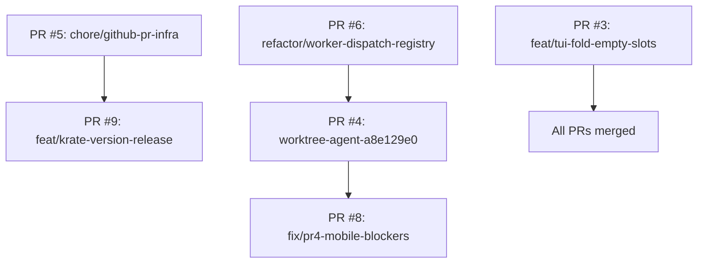

# Merging Strategy for Six Open PRs

## Overview
This document outlines the sequence, validation, and rollback plan for merging the six open Pull Requests in the ko2-tools repository. The plan is based on analysis of dependencies, risk levels, and potential conflicts derived from the existing PR testing plan (`docs/plans/pr-testing-plan.md`).

## 1. Merge Order and Rationale

**Dependencies:**
- PR #8 (`fix/pr4-mobile-blockers`) depends on PR #4 (`worktree-agent-a8e129e0`). Therefore PR #4 must be merged before PR #8.
- All other PRs are independent and can be merged in any order, but we recommend grouping by risk and CI impact.

**Recommended Sequence:**

**Rationale:**
1. **PR #5 (low risk, documentation)** – adds CODEOWNERS and PR template; no runtime impact.
2. **PR #9 (low risk, release workflow)** – adds `--version` flag and GitHub Actions release workflow; should be validated before other changes that might affect versioning.
3. **PR #6 (low risk, refactor)** – refactors worker dispatch; should be merged before mobile‑related changes to avoid rebasing conflicts.
4. **PR #4 (medium risk, mobile scaffold)** – foundational mobile feature scaffold; must be merged before its dependent PR #8.
5. **PR #8 (medium risk, mobile blockers)** – depends on PR #4; rebase on top of PR #4 before merging.
6. **PR #3 (medium risk, UI feature)** – TUI folding of empty slots; can be merged in parallel but placed last to avoid interfering with worker dispatch changes.

## 2. Conflict Analysis and Resolution

| PR Pair | Overlapping Files | Conflict Risk | Resolution Approach |
|---------|-------------------|---------------|---------------------|
| PR #4 ↔ PR #8 | `src/mobile/`, `src/core/client.py`, `src/core/midi_transport.py`, `pyproject.toml` | High | Merge PR #4 first, then rebase PR #8 onto updated `main`. Manually resolve any conflicts in optional dependencies and transport abstraction. |
| PR #6 ↔ PR #3 | `src/tui/worker.py` vs `src/tui/ui.py`, `src/tui/selectors.py` | Low | No expected overlap; different modules. If conflicts arise, prioritize PR #6 (refactor) then adapt PR #3 folding logic. |
| PR #9 ↔ PR #5 | `.github/workflows/release.yml` vs `.github/CODEOWNERS`, `.github/PULL_REQUEST_TEMPLATE.md` | None | Separate files; no conflict. |
| PR #4 ↔ PR #9 | `pyproject.toml` (optional‑dependencies) | Medium | Both may edit `pyproject.toml`. Merge PR #9 first (adds version), then PR #4 (adds optional dependencies) with manual merge of the `[project.optional‑dependencies]` section. |
| PR #6 ↔ PR #4 | `src/tui/worker.py` vs `src/mobile/` | Low | No overlap. |

**Key Conflict Resolution Steps:**
- Before merging PR #8, rebase its branch onto the current `main` (which includes PR #4) and run the full test suite.
- Use `git merge --no‑ff` for each PR to preserve merge commits, making reverts easier.
- If `pyproject.toml` conflicts occur, keep both the version field (PR #9) and optional‑dependencies (PR #4) blocks.

## 3. CI Integration

**Existing CI Pipeline:**
- `.github/workflows/pylint.yml` – runs pylint on Python 3.8‑3.10.
- `.github/workflows/test.yml` (likely added by PR #9) – runs pytest unit tests.
- (Optional) `ruff`, `black`, `mypy` checks (if configured).

**Pre‑merge Verification for Each PR:**
1. **Automated Checks:** Ensure GitHub Actions pass (pylint, tests).
2. **Local Validation:** Run `pytest tests/unit/` and `pytest tests/e2e/` (where applicable) on the PR branch.
3. **Linting:** Execute `ruff check .` and `black --check .` (or `make lint` if available).
4. **Mobile Integration Tests:** For PR #4 and PR #8, run `tests/unit/test_mobile_transport.py` and emulator‑based integration tests (`tests/emulator.py`).
5. **TUI Visual Tests:** For PR #3, manually verify folding behavior using the TUI.

**CI Enhancements Recommended:**
- Add a CI job that runs the emulator in the background for integration tests (requires Docker).
- Ensure the release workflow (PR #9) is tested via a dry‑run on a personal fork before merging.

## 4. Post‑merge Validation

After each merge, perform the following smoke tests to ensure no regression:

| Merge | Validation Steps |
|-------|------------------|
| PR #5 | Verify CODEOWNERS syntax via GitHub’s “preview” feature; create a test PR to confirm template appears. |
| PR #9 | Run `krate --version` and compare with `pyproject.toml` version; trigger a dummy tag push (e.g., `v0.1.0‑test`) to verify release workflow does not fail. |
| PR #6 | Run the existing test suite for worker dispatch (`tests/unit/test_tui_worker.py`); ensure all TUI operations (move, copy, squash) still work. |
| PR #4 | Import mobile module with and without optional dependencies; run mobile bridge integration tests with emulator; verify transport abstraction works. |
| PR #8 | Repeat mobile integration tests atop PR #4 changes; test optional dependency installation and graceful fallback. |
| PR #3 | Launch TUI, verify empty slots are folded, expand/collapse works, keyboard navigation remains intact. |

**Cross‑PR Integration Tests:**
- After merging PR #4 and PR #8, run the full mobile bridge test suite.
- After merging PR #3, run TUI end‑to‑end tests (`tests/e2e/test_tui_upload_move.py`).

## 5. Rollback Plan

If a merged PR introduces critical issues:

1. **Identify the faulty merge commit** using `git log --oneline --graph`.
2. **Revert** with `git revert -m 1 <merge‑commit‑hash>` (if the merge was a fast‑forward, use `git revert <commit>`).
3. **Push the revert** to `main` immediately.
4. **Create a follow‑up issue** in beads (e.g., `ko2‑tools‑rollback‑<pr>`) with details.
5. **If revert causes conflicts**, consider a forward‑fix PR instead of reverting; evaluate impact.

**Rollback Priority:** Revert in reverse merge order (latest first). If PR #8 causes issues, revert PR #8 first, then PR #4 if necessary.

## 6. Branch Cleanup and Beads Issues

**Branch Cleanup:**
- After merging each PR, delete the remote branch (optional but recommended).
- Keep local branches for reference until all PRs are merged.

**Beads Issues Linked to PRs:**
- `ko2‑tools‑56v` → PR #3 (TUI folding)
- `ko2‑tools‑jvr` → PR #9? (release workflow)
- `ko2‑tools‑v8s` → PR #8? (mobile blockers)

**Actions:**
- After merging a PR, update the corresponding beads issue:
  - `bd update <id> --claim`
  - `bd close <id> --reason "Merged via PR #<num>"`
- If no beads issue exists, create one with `discovered‑from` linking to the PR.

## 7. Communication Plan

**Stakeholders:** Core contributors, repository admins, mobile feature testers.

**Notifications:**
- After each successful merge, post a message in the team channel (Slack/Discord) with the PR number, summary, and any required follow‑up actions.
- Update the project’s `CHANGELOG.md` (if maintained) with a brief entry.
- Ensure documentation (`README.md`, `PROTOCOL.md`) is updated if the PR introduces user‑visible changes.

**Post‑merge Documentation Updates:**
- PR #5: Update `CONTRIBUTING.md` to mention CODEOWNERS and PR template.
- PR #9: Add release instructions to `README.md`.
- PR #4/8: Add mobile bridge setup notes to `docs/` directory.

---

## Execution Checklist

- [ ] Merge PR #5 (`chore/github‑pr‑infra`)
- [ ] Merge PR #9 (`feat/krate‑version‑release`)
- [ ] Merge PR #6 (`refactor/worker‑dispatch‑registry`)
- [ ] Merge PR #4 (`worktree‑agent‑a8e129e0`)
- [ ] Rebase PR #8 onto `main` and resolve any conflicts
- [ ] Merge PR #8 (`fix/pr4‑mobile‑blockers`)
- [ ] Merge PR #3 (`feat/tui‑fold‑empty‑slots`)
- [ ] Run post‑merge validation suite
- [ ] Close linked beads issues
- [ ] Delete remote branches (optional)
- [ ] Notify stakeholders

---

*Document generated: 2026‑03‑24*  
*Based on PR testing plan: docs/plans/pr‑testing‑plan.md*