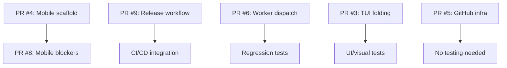

# PR Testing Plan

## Overview

This document outlines a comprehensive testing strategy for the six open Pull Requests (PRs) in the ko2-tools repository. The plan is based on analysis of each PR's scope, risk level, and dependencies. It provides detailed testing objectives, scenarios, existing coverage, gaps, and recommendations for automation and risk mitigation.

## Overall Testing Strategy

### Dependencies and Testing Order

1. **PR #4 (worktree-agent-a8e129e0)** must be tested before **PR #8 (fix/pr4-mobile-blockers)** because PR #8 depends on PR #4.
2. **PR #9 (feat/krate-version-release)** and **PR #5 (chore/github-pr-infra)** are independent and can be tested in parallel.
3. **PR #6 (refactor/worker-dispatch-registry)** is a refactor; its tests should pass with existing test suite.
4. **PR #3 (feat/tui-fold-empty-slots)** is UI-focused and requires manual/visual validation.

### Recommended Testing Sequence

### Continuous Integration Recommendations

- Run unit tests for all PRs automatically via GitHub Actions (already defined in `pylint.yml`).
- Add integration test jobs for mobile bridge and MIDI transport.
- Implement a smoke test for the `--version` flag (PR #9).
- Ensure UI changes are covered by snapshot tests or visual regression testing (if feasible).
- Use `pytest` with coverage reporting; enforce a minimum coverage threshold for new code.

---

## PR #9: feat/krate-version-release

### PR Summary
- **Branch**: `feat/krate-version-release`
- **Title**: Adds GitHub Actions release workflow, version flag in CLI
- **Risk**: Low (additive)

### Testing Objectives
1. Verify that the new `--version` CLI flag works correctly.
2. Ensure the GitHub Actions release workflow triggers on tag pushes and creates releases.
3. Confirm that the version string matches the project's version (e.g., from `pyproject.toml`).

### Test Types
- **Unit test** for CLI flag parsing.
- **Integration test** for GitHub Actions workflow (simulated via `act` or manual trigger).
- **Manual test** of release creation.

### Test Scenarios
| Scenario | Expected Outcome |
|----------|------------------|
| Run `krate --version` | Prints version string (e.g., `krate 1.2.3`) |
| Run `krate --help` | Shows `--version` in help text |
| Push a git tag `v*` | GitHub Actions workflow runs and creates a release |
| Workflow fails on missing secrets | Appropriate error handling, no release created |

### Existing Test Coverage
- No existing tests for `--version` flag (new feature).
- Existing CLI parsing tests in `tests/unit/test_cli_output.py` may cover flag addition.

### Gaps and Additional Tests Needed
1. **Unit test** for `cli_main.py` to assert `--version` prints correct version.
2. **Integration test** that ensures the version matches `pyproject.toml`.
3. **Workflow validation** using `act` or a dry‑run script.

### Risk Mitigation Strategies
- Keep the `--version` flag simple (no side‑effects).
- Use `argparse`’s built‑in `version` action to avoid custom logic.
- Test the GitHub Actions workflow in a personal fork before merging.

### Automation Feasibility
- High. Unit test can be added to `test_cli_output.py`.
- GitHub Actions workflow can be tested with `act` locally (medium effort).
- Release automation is a one‑time verification.

---

## PR #8: fix/pr4-mobile-blockers

### PR Summary
- **Branch**: `fix/pr4-mobile-blockers`
- **Title**: Adds optional dependencies, mobile bridge, MIDI transport abstraction, client modifications
- **Risk**: Medium (depends on PR #4)

### Testing Objectives
1. Verify that optional dependencies are correctly declared and do not break installation when missing.
2. Test the mobile bridge communication with the KO2 device (or emulator).
3. Validate MIDI transport abstraction works across different transports (USB‑MIDI, virtual ports).
4. Ensure client modifications maintain backward compatibility.

### Test Types
- **Unit tests** for new MIDI transport classes.
- **Integration tests** for mobile bridge using the emulator.
- **Manual tests** on actual hardware (if available).
- **Dependency tests** with and without optional packages installed.

### Test Scenarios
| Scenario | Expected Outcome |
|----------|------------------|
| Install without optional deps | Core functionality works, mobile features gracefully disabled |
| Install with optional deps | Mobile bridge imports successfully |
| Mobile bridge connects to emulator | Can send/receive MIDI messages |
| MIDI transport abstraction switches between USB and virtual ports | No data loss, correct port selection |
| Client uses new transport | Existing operations (upload, download, info) still work |

### Existing Test Coverage
- `tests/unit/test_mobile_transport.py` (likely exists).
- `tests/unit/test_ko2_client_channels.py` covers client modifications.
- Integration tests for mobile bridge may be lacking.

### Gaps and Additional Tests Needed
1. **Integration test** that exercises the mobile bridge end‑to‑end with the emulator.
2. **Dependency‑aware tests** that simulate missing optional packages.
3. **Transport fallback tests** to ensure robustness when a MIDI port is unavailable.

### Risk Mitigation Strategies
- Use feature detection (try‑import) for optional dependencies.
- Provide clear error messages when mobile features are requested but dependencies missing.
- Keep the MIDI transport abstraction behind an interface to allow mocking in tests.

### Automation Feasibility
- Medium. Integration tests require a running emulator (`tests/emulator.py`).
- Dependency tests can be run in isolated virtual environments (possible but heavy).
- Hardware‑dependent tests cannot be fully automated; rely on manual validation.

---

## PR #6: refactor/worker-dispatch-registry

### PR Summary
- **Branch**: `refactor/worker-dispatch-registry`
- **Title**: Refactors worker dispatch to registry pattern
- **Risk**: Low (refactor‑only)

### Testing Objectives
1. Ensure the refactor does not change external behavior.
2. Verify that all existing worker dispatch scenarios still work.
3. Confirm that the new registry pattern is extensible and follows the project’s design principles.

### Test Types
- **Regression tests** (run existing test suite).
- **Unit tests** for new registry classes (if any).
- **Integration tests** for TUI worker interactions.

### Test Scenarios
| Scenario | Expected Outcome |
|----------|------------------|
| Dispatch a known worker task | Same result as before refactor |
| Register a new worker type | Can be dispatched successfully |
| Attempt to dispatch unknown task | Appropriate error (KeyError or custom) |
| Concurrent dispatches | No race conditions, threadsafety preserved |

### Existing Test Coverage
- `tests/unit/test_tui_worker.py` covers worker dispatch.
- `tests/unit/test_tui_app.py` may exercise worker integration.
- `tests/e2e/test_tui_upload_move.py` includes end‑to‑end worker flows.

### Gaps and Additional Tests Needed
1. **Registry‑specific unit tests** (if new registry module introduced).
2. **Edge‑case tests** for thread‑safety and error handling.
3. **Performance benchmark** to ensure no regression in dispatch latency (optional).

### Risk Mitigation Strategies
- Keep the refactor small and incremental.
- Use the existing test suite as a safety net; ensure 100% pass before merging.
- Add type hints and static analysis (mypy) to catch interface mismatches.

### Automation Feasibility
- High. All tests are already automated; just need to run them.
- No new manual testing required if existing tests pass.

---

## PR #5: chore/github-pr-infra

### PR Summary
- **Branch**: `chore/github-pr-infra`
- **Title**: Adds CODEOWNERS and PR template
- **Risk**: None (documentation only)

### Testing Objectives
1. Validate that CODEOWNERS syntax is correct and GitHub will interpret it as intended.
2. Ensure PR template appears when creating a new PR via GitHub UI.

### Test Types
- **Manual review** of file syntax.
- **Dry‑run** using GitHub’s “preview” feature (if available).

### Test Scenarios
| Scenario | Expected Outcome |
|----------|------------------|
| Create a new PR on GitHub | PR template appears in description field |
| Modify a file covered by CODEOWNERS | Appropriate team is requested for review |
| Syntax error in CODEOWNERS | GitHub warns or ignores the rule |

### Existing Test Coverage
- No automated tests for GitHub configuration files.

### Gaps and Additional Tests Needed
- None; these files are not runtime‑critical.

### Risk Mitigation Strategies
- Merge during a low‑activity period; can be reverted instantly if problems arise.
- Ask a repository admin to verify the changes before merging.

### Automation Feasibility
- Low. Manual validation suffices.
- Could add a lint step (e.g., `github‑linguist` or `check‑codeowners`) to CI.

---

## PR #4: worktree-agent-a8e129e0

### PR Summary
- **Branch**: `worktree-agent-a8e129e0`
- **Title**: Mobile feature scaffold, optional dependencies, bridge, transport abstraction
- **Risk**: Medium (extensive unit tests)

### Testing Objectives
1. Verify that the mobile feature scaffold integrates with the existing codebase.
2. Test optional dependency handling (same as PR #8).
3. Validate transport abstraction with both USB and virtual MIDI ports.
4. Ensure the bridge can communicate with the KO2 device (or emulator).

### Test Types
- **Unit tests** (already extensive per analysis).
- **Integration tests** with the emulator.
- **Manual hardware tests** (if available).

### Test Scenarios
| Scenario | Expected Outcome |
|----------|------------------|
| Import mobile module without optional deps | Graceful degradation, feature disabled |
| Import with optional deps | Module loads, bridge classes available |
| Bridge connects to emulator | Successful handshake, can query device info |
| Transport abstraction switches ports | No data corruption, correct port enumeration |
| Concurrent access to bridge | Thread‑safe or proper locking |

### Existing Test Coverage
- Extensive unit tests (per analysis).
- `tests/unit/test_mobile_transport.py` likely covers transport.
- `tests/unit/test_ko2_client_channels.py` may test client integration.

### Gaps and Additional Tests Needed
1. **Integration tests** that combine mobile bridge, transport, and client.
2. **Error‑handling tests** for network interruptions, timeouts, and malformed responses.
3. **Performance tests** to ensure bridge does not introduce latency beyond acceptable bounds.

### Risk Mitigation Strategies
- Feature‑flag the mobile functionality (disabled by default).
- Provide detailed logging for debugging bridge communication.
- Use the emulator as a CI‑friendly substitute for hardware.

### Automation Feasibility
- Medium. Integration tests can be automated with the emulator.
- Hardware‑specific tests require manual intervention.

---

## PR #3: feat/tui-fold-empty-slots

### PR Summary
- **Branch**: `feat/tui-fold-empty-slots`
- **Title**: Adds folding of consecutive empty slots in TUI
- **Risk**: Medium (UI complexity)

### Testing Objectives
1. Verify that empty slots are visually folded in the TUI slot list.
2. Ensure folding does not affect slot indices or underlying data.
3. Confirm that user interactions (selecting a folded group, expanding) work as designed.
4. Test edge cases: all empty slots, no empty slots, mixed content.

### Test Types
- **Unit tests** for the folding logic (pure function).
- **UI integration tests** using `urwid` test utilities.
- **Manual visual tests** (necessary for final validation).

### Test Scenarios
| Scenario | Expected Outcome |
|----------|------------------|
| List with consecutive empty slots | Display shows “+3 empty slots” line |
| List with no empty slots | No folding, all slots shown individually |
| List with all empty slots | Single folded line representing all slots |
| Selecting a folded line | Expands to reveal individual empty slots |
| Keyboard navigation | Focus moves correctly through folded/expanded items |
| Slot data changes (upload) | Folded representation updates accordingly |

### Existing Test Coverage
- `tests/unit/test_tui_selectors.py` may contain slot‑list logic.
- `tests/unit/test_tui_state.py` covers state management.
- `tests/unit/test_tui_app.py` includes UI integration.

### Gaps and Additional Tests Needed
1. **Unit tests** for the new folding function (likely in `src/tui/selectors.py` or `src/tui/ui.py`).
2. **UI integration tests** that simulate user interactions with folded groups.
3. **Visual regression tests** (snapshots) to catch unintended layout changes.

### Risk Mitigation Strategies
- Implement folding as a pure transformation of the slot list (easily testable).
- Provide a keyboard shortcut to toggle folding on/off for accessibility.
- Add a visual indicator (e.g., “▶” / “▼”) to make folding state obvious.

### Automation Feasibility
- Medium for unit and integration tests.
- Visual validation requires manual inspection or snapshot testing (which can be automated but needs maintenance).

---

## Cross‑PR Testing Considerations

### Dependency Testing
- PR #4 and PR #8 must be tested together after PR #4 is merged into the target branch.
- Recommended approach: merge PR #4, then rebase PR #8 on top, run full test suite.

### Continuous Integration Pipeline
1. **Pre‑merge checks**:
   - Unit tests (pytest) for all PRs.
   - Integration tests for mobile bridge (requires emulator).
   - Linting (ruff, mypy) and formatting (black).
2. **Post‑merge verification**:
   - Smoke test of CLI `--version` flag.
   - End‑to‑end TUI test with emulator.
   - Automated release workflow dry‑run (on tag push).

### Risk Matrix

| PR | Risk Level | Test Effort | Automation Coverage |
|----|------------|-------------|---------------------|
| #9 | Low        | Low         | High                |
| #8 | Medium     | Medium      | Medium              |
| #6 | Low        | Low         | High                |
| #5 | None       | None        | Low                 |
| #4 | Medium     | High        | Medium              |
| #3 | Medium     | Medium      | Medium              |

### Recommended Actions

1. **Immediate**:
   - Add unit test for `--version` flag (PR #9).
   - Run existing test suite for PR #6 to confirm no regressions.
   - Manually verify CODEOWNERS and PR template (PR #5).
2. **Before merging PR #4**:
   - Run integration tests with emulator.
   - Perform manual hardware test if possible.
3. **Before merging PR #8**:
   - Re‑run integration tests atop PR #4 changes.
   - Test optional dependency installation.
4. **Before merging PR #3**:
   - Write unit tests for folding logic.
   - Conduct manual TUI validation.

## Conclusion

This testing plan provides a structured approach to validate each open PR, ensuring that new features work correctly, refactors do not introduce regressions, and risky changes are adequately mitigated. The plan emphasizes automation where feasible and outlines manual validation steps where necessary.

By following this plan, the team can merge these PRs with confidence, maintaining the high quality and reliability of the ko2‑tools project.

---

*Document last updated: 2026‑03‑24*